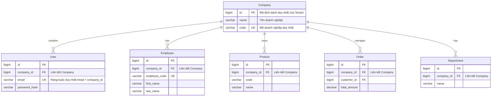
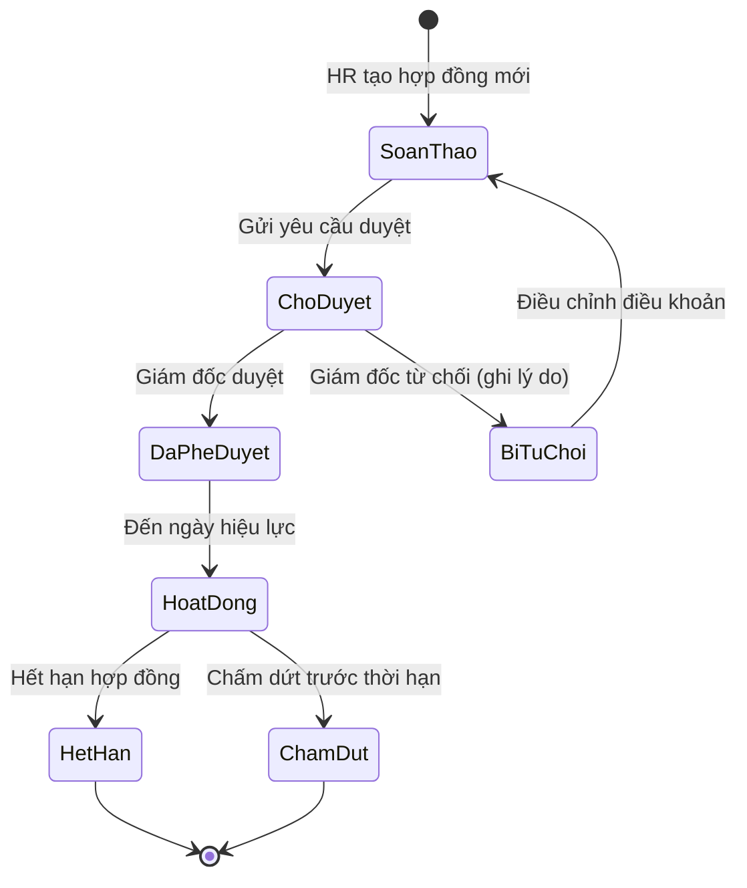
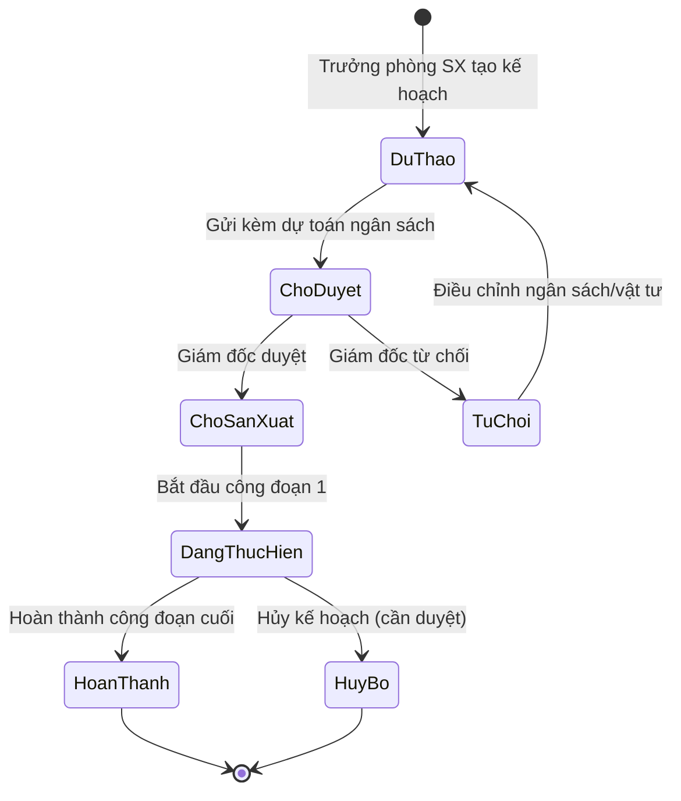

# TÀI LIỆU ĐẶC TẢ YÊU CẦU CHI TIẾT (SRS)
## Hệ thống Quản lý Doanh nghiệp SaaS Multi-tenant cho SMEs

---

## 1. GIỚI THIỆU & ĐỊNH HƯỚNG HỆ THỐNG

### 1.1. Vấn đề Thực tế & Nỗi đau của Doanh nghiệp (SME Pain Points)
Các doanh nghiệp vừa và nhỏ (SMEs) tại địa phương hiện đang đối mặt với những thách thức quản trị nghiêm trọng:
*   **Rời rạc và Thất thoát dữ liệu:** Doanh nghiệp vận hành dựa trên các công cụ thủ công hoặc ứng dụng nhắn tin (Zalo, Excel, Google Sheets) dẫn đến dữ liệu nhân sự, sản xuất và kinh doanh bị chia cắt, dễ sai lệch và khó khăn khi tra cứu lịch sử.
*   **Khó khăn tối ưu Thuế và Kiểm soát Tài chính:** Việc quản lý hóa đơn, doanh thu và chi phí sản xuất (như nguyên vật liệu, nhân công) không đồng bộ khiến bộ phận kế toán gặp khó khăn khi kê khai thuế, tối ưu chi phí hợp lệ và kiểm soát dòng tiền thực tế.
*   **Nỗi đau Lương công đoạn Sản xuất:** Tại các phân xưởng, việc tính toán lương cho công nhân theo giờ công hoặc sản phẩm khoán thủ công cực kỳ phức tạp và dễ phát sinh lỗi, gây tranh chấp nội bộ và làm mất thời gian của bộ phận kế toán/HR vào cuối tháng.
*   **Quy trình phê duyệt thủ công chưa tối ưu:** Ở các doanh nghiệp địa phương, Chủ doanh nghiệp hoặc Giám đốc thường kiêm nhiệm nhiều việc và trực tiếp duyệt các đề xuất quan trọng (đơn hàng lớn, ký hợp đồng lao động, ngân sách sản xuất). Quy trình truyền thống qua giấy tờ hoặc tin nhắn gây chậm trễ trong vận hành hàng ngày và khó lưu lại vết phê duyệt chính thức.
*   **Chi phí triển khai ERP quá lớn:** Các giải pháp ERP toàn diện trên thị trường thường có giá thành vượt quá khả năng chi trả của các SMEs có quy mô từ 50-200 nhân sự và yêu cầu đội ngũ vận hành kỹ thuật chuyên sâu.

### 1.2. Nhu cầu Cần thiết
SMEs đang rất cần một nền tảng quản trị hợp nhất có các đặc điểm:
*   **Tích hợp đầy đủ:** Gắn kết chặt chẽ các phân hệ lõi: Quản lý nhân sự (HRM), Chấm công - Tính lương (Payroll), Sản xuất (Production) có định mức BOM và CRM - Quản lý đơn hàng/công nợ.
*   **SaaS Multi-tenant:** Mô hình cho thuê phần mềm giúp doanh nghiệp tối ưu chi phí hạ tầng, triển khai nhanh chóng nhưng vẫn đảm bảo tính bảo mật và cách ly dữ liệu tuyệt đối giữa các tenant (doanh nghiệp).
*   **Tự động hóa & Linh hoạt:** Cơ chế tính lương linh động (hỗ trợ cả lương văn phòng và lương công đoạn) cùng tính năng cấu hình ngưỡng phê duyệt của Giám đốc linh hoạt theo từng quy mô doanh nghiệp.

### 1.3. Mục tiêu Hệ thống
*   **Số hóa toàn diện:** Xây dựng hệ thống số hóa quy trình vận hành từ hồ sơ nhân sự, hợp đồng, chấm công đến lập kế hoạch sản xuất, xuất kho nguyên vật liệu và quản lý doanh thu.
*   **Chính xác và Minh bạch:** Tự động hóa tính lương công đoạn dựa trên dữ liệu sản xuất thực tế và định mức BOM sản phẩm, hạn chế tối đa sai sót của con người.
*   **Bảo mật Tuyệt đối:** Đảm bảo cách ly dữ liệu ở mức cơ sở dữ liệu qua cột `company_id` ở mọi bảng và kiểm tra quyền truy cập chặt chẽ qua token JWT.
*   **Rút ngắn thời gian Ra quyết định:** Cung cấp ứng dụng Web đáp ứng đầy đủ luồng phê duyệt của Giám đốc/Chủ doanh nghiệp từ xa giúp giảm thiểu thời gian chờ duyệt xuống dưới 1 giờ.

### 1.4. Phạm vi Tài liệu & Phạm vi Hệ thống
*   **Phạm vi tài liệu:** Đặc tả chi tiết các yêu cầu chức năng của 2 phân hệ chính (HRM và Operations), thiết kế sơ đồ thực thể dữ liệu (ERD), luồng xử lý chính và các yêu cầu phi chức năng phục vụ cho giai đoạn Phase 1.
*   **Phạm vi hệ thống (Phase 1):**
    *   **Phân hệ HRM:** Quản lý thông tin nhân viên, cơ cấu tổ chức đa vai trò/phòng ban, hợp đồng lao động, chấm công đa ca, yêu cầu nghỉ phép và hệ thống tính lương song song (lương ngày công và lương công đoạn).
    *   **Phân hệ Operations:** Quản lý danh mục sản phẩm/nguyên vật liệu có cấu trúc BOM định mức, lập kế hoạch và theo dõi công đoạn sản xuất, quản lý khách hàng, đơn hàng (có cơ chế duyệt vượt ngưỡng), công nợ khách hàng và báo cáo doanh thu.
*   **Ngoại lệ (Phase 2):** Tích hợp thiết bị chấm công phần cứng (FaceID/vân tay), kết nối trực tiếp cổng thanh toán ngân hàng, phần mềm kế toán ngoài và chữ ký số điện tử. (Tuy nhiên cấu trúc cơ sở dữ liệu Phase 1 sẽ được chừa sẵn các trường liên kết để dễ dàng tích hợp sau này).

### 1.5. Công nghệ Triển khai & Ứng dụng
*   **Frontend:** Sử dụng **React.js** kết hợp với **Vite** để xây dựng giao diện Single Page Application (SPA) mượt mà, áp dụng **CSS3** với thiết kế hiện đại, responsive hoàn toàn trên Desktop và Tablet.
*   **Backend:** Sử dụng ngôn ngữ **Java 17** kết hợp với framework **Spring Boot (v4.1.0)**, quản lý dự án bằng **Gradle-Groovy**, xây dựng theo kiến trúc RESTful API.
*   **Database:** Sử dụng hệ quản trị cơ sở dữ liệu quan hệ **MySQL**, triển khai theo thiết kế Shared-Database (một cơ sở dữ liệu dùng chung cho tất cả các tenant).
*   **Security & Auth:** Sử dụng **Spring Security** ở Backend. Xác thực người dùng qua **JWT** (JSON Web Token) - Token này sẽ chứa các thông tin xác thực quan trọng như mã doanh nghiệp (`company_id`), vai trò (`role_id`) và phòng ban (`department_id`) sau khi đăng nhập thành công. Mã hóa mật khẩu bằng thuật toán **bcrypt**.
*   **Deployment:** Đóng gói ứng dụng qua **Docker**, triển khai trên các dịch vụ cloud (AWS/GCP/DigitalOcean) hỗ trợ khả năng tự động mở rộng (Scalability) khi lượng tenant tăng.

### 1.6. Đối tượng Độc giả hướng tới
*   **Ban Giám đốc & Quản lý Doanh nghiệp (Chủ doanh nghiệp):** Hiểu được luồng vận hành tổng thể và cách hệ thống hỗ trợ giải quyết bài toán quản trị.
*   **Đội ngũ Phát triển Phần mềm (Developers):** Hiểu rõ chi tiết nghiệp vụ và sơ đồ thiết kế cơ sở dữ liệu để thực hiện lập trình.
*   **Đội ngũ Đảm bảo Chất lượng (QA/QC):** Sử dụng tài liệu để thiết lập kịch bản kiểm thử (Test Cases/Test Suites) và nghiệm thu phần mềm (UAT).

### 1.7. Bảng thuật ngữ & Từ viết tắt (Glossary)
| Thuật ngữ / Từ viết tắt | Định nghĩa đầy đủ | Ý nghĩa / Ứng dụng trong hệ thống |
|---|---|---|
| **ERP** | Enterprise Resource Planning | Hệ thống hoạch định nguồn lực doanh nghiệp, tích hợp nhiều quy trình vận hành. |
| **SMEs** | Small and Medium-sized Enterprises | Doanh nghiệp vừa và nhỏ (quy mô nhân sự phục vụ chính là 50-200 người). |
| **SaaS** | Software as a Service | Mô hình phân phối phần mềm dưới dạng dịch vụ chạy trên nền tảng đám mây. |
| **Multi-tenant** | Kiến trúc đa khách thuê | Một phiên bản phần mềm chạy trên máy chủ để phục vụ cho nhiều doanh nghiệp độc lập. |
| **BOD / Business Owner** | Board of Directors / Business Owner | Ban Giám đốc hoặc Chủ doanh nghiệp, là người có quyền cao nhất phê duyệt các nghiệp vụ vượt ngưỡng. |
| **JWT** | JSON Web Token | Chuỗi ký mã hóa dạng JSON để truyền tải thông tin định danh (chứa `company_id`, `role_id`, `department_id`). |
| **RBAC** | Role-Based Access Control | Cơ chế phân quyền truy cập tài nguyên hệ thống dựa trên vai trò của người dùng. |
| **BOM** | Bill of Materials | Định mức nguyên vật liệu cấu thành sản phẩm dùng trong phân hệ quản lý sản xuất. |
| **HRM** | Human Resource Management | Phân hệ quản lý nguồn nhân lực (hồ sơ, phòng ban, ca kíp, chấm công, tính lương). |
| **OT** | Overtime | Thời gian làm việc ngoài giờ của nhân viên, áp dụng hệ số nhân lương tương ứng. |
| **IDOR** | Insecure Direct Object Reference | Lỗ hổng bảo mật cho phép truy cập trái phép tài nguyên bằng cách thay đổi ID trong yêu cầu. |

---

## 2. KIẾN TRÚC HỆ THỐNG & CƠ CHẾ CÁCH LY DỮ LIỆU (TENANT ISOLATION)

### 2.1. Mô hình Dữ liệu Shared-Database
Mục tiêu cốt lõi của kiến trúc SaaS Multi-tenant trong hệ thống này là sử dụng chung một database duy nhất nhằm tiết kiệm chi phí tài nguyên và vận hành, nhưng đảm bảo tính cách ly dữ liệu logic giữa các doanh nghiệp.

*   Mọi bảng nghiệp vụ cốt lõi trong Database đều bắt buộc chứa cột `company_id`.
*   Tầng ORM/Repository và các API endpoint phải áp dụng global filter/middleware tự động lọc dữ liệu theo `company_id` lấy từ token của user đăng nhập.
*   **An toàn dữ liệu:** Nghiêm cấm nhận `company_id` từ request body hoặc query parameter đối với các thao tác truy vấn dữ liệu nhạy cảm để tránh lỗ hổng IDOR.

#### Sơ đồ minh họa liên kết cách ly dữ liệu:


### 2.2. Cơ chế Xác thực & Phân quyền Đa Vai trò
*   **Ràng buộc tài khoản:** Unique index trên cặp `(email, company_id)`. Một email chỉ thuộc về 1 doanh nghiệp duy nhất, đảm bảo tính bảo mật và truy vết hoạt động.
*   **Luồng Đăng nhập (Login Flow):**
    ```mermaid
    sequenceDiagram
        autonumber
        User->>System: Credentials (Email, Password)
        System->>System: Validate credentials
        System->>System: Get user's roles & departments
        alt Single Role/Department
            System->>User: Issue JWT (contains company_id, role_id, dept_id) & Redirect to Home
        else Multiple Roles/Departments
            System->>User: Redirect to Role/Department selection screen
            User->>System: Select Active Role & Department for session
            System->>User: Issue JWT (contains company_id, role_id, dept_id) & Redirect to Home
        end
    ```
    *   **Diễn giải luồng đăng nhập:**
        1.  **Xác thực ban đầu (Bước 1-3):** Người dùng gửi thông tin đăng nhập lên hệ thống. Backend tiến hành xác thực mật khẩu qua bcrypt. Sau đó, hệ thống truy vấn bảng trung gian `User_Role_Department` để kiểm tra các phòng ban và vai trò mà tài khoản này kiêm nhiệm.
        2.  **Trường hợp 1 (Nhánh alt - Single Role/Department):** Nếu người dùng chỉ có duy nhất một vai trò ở một phòng ban, hệ thống sẽ bỏ qua bước lựa chọn, ngay lập tức tạo token JWT chứa thông tin `company_id`, `role_id` và `department_id` mặc định, phát hành token cho client và chuyển tiếp vào hệ thống.
        3.  **Trường hợp 2 (Nhánh alt - Multiple Roles/Departments):** Nếu người dùng kiêm nhiệm nhiều vai trò/phòng ban khác nhau, hệ thống trả về danh sách vai trò hiện có và chuyển hướng tới màn hình lựa chọn. Người dùng chọn vai trò và phòng ban làm việc cụ thể cho phiên này, gửi yêu cầu lên Backend để nhận token JWT tương ứng chứa thông tin đã chọn.
*   **Cơ chế Phân quyền (Authorization):**
    *   Quyền thao tác dữ liệu được phân chia dựa trên `role_id` và `department_id` được xác định từ token JWT của phiên làm việc.
    *   **Triển khai kỹ thuật:** Sử dụng framework **Spring Security** phía Backend để cấu hình cơ chế bảo mật này.
    *   Khi có request gửi tới từ Client, một Filter tùy chỉnh trong Spring Security sẽ trích xuất token JWT từ Authorization Header, kiểm tra tính hợp lệ và trích xuất các claims: `company_id`, `role_id`, `department_id`.
    *   Hệ thống nạp các thông tin này vào `SecurityContextHolder` dưới dạng đối tượng Authentication tùy biến.
    *   Tại tầng Controller/Service, hệ thống sử dụng chú thích phân quyền phương thức (Method Security) như `@PreAuthorize` kết hợp với các Custom Security Expression để kiểm tra xem vai trò hiện tại của người dùng có được phép thực hiện hành động trên dữ liệu thuộc phòng ban đó hay không. Đồng thời, mọi câu lệnh SQL đều được Backend tự động chèn thêm điều kiện filter `WHERE company_id = ?` lấy trực tiếp từ Context này.

---

## 3. CẤU HÌNH & QUY TRÌNH PHÊ DUYỆT CỦA GIÁM ĐỐC / CHỦ DOANH NGHIỆP (APPROVAL WORKFLOW)

### 3.1. Thiết lập Ngưỡng Phê duyệt (Approval Settings)
Cấu hình phê duyệt được lưu trữ trong bảng `ApprovalSettings` và cho phép từng doanh nghiệp (tenant) tùy chỉnh linh hoạt các quy tắc nghiệp vụ theo nhu cầu quản trị nội bộ.

*   **Bảng lưu trữ cấu hình:** `ApprovalSettings`
*   **Giải nghĩa chi tiết các thuộc tính:**
    1.  `id` (BigInt - Primary Key): Định danh duy nhất cho cấu hình.
    2.  `company_id` (BigInt - Foreign Key): Mã doanh nghiệp (Tenant ID). Tham chiếu đến bảng `Company`, dùng để phân biệt cấu hình giữa các công ty.
    3.  `rule_type` (VarChar): Loại quy tắc phê duyệt được áp dụng. Các giá trị hợp lệ gồm:
        *   `ORDER_AMOUNT_THRESHOLD`: Quy tắc phê duyệt đơn hàng khi tổng giá trị vượt quá mức quy định.
        *   `CONTRACT_APPROVAL`: Quy tắc duyệt hợp đồng tuyển dụng mới hoặc quyết định chấm dứt hợp đồng.
        *   `PRODUCTION_PLAN_APPROVAL`: Quy tắc duyệt kế hoạch sản xuất mới được lập và ngân sách dự toán đi kèm.
    4.  `threshold_value` (Decimal): Ngưỡng giá trị bằng số để kích hoạt phê duyệt (Ví dụ: `50,000,000` đối với `ORDER_AMOUNT_THRESHOLD`). Đối với các quy tắc không áp dụng ngưỡng số tiền như duyệt hợp đồng hoặc duyệt kế hoạch sản xuất, trường này sẽ có giá trị mặc định là `0` hoặc `NULL`.
    5.  `is_enabled` (Boolean): Trạng thái bật/tắt của quy tắc. Nếu đặt là `false`, hệ thống sẽ tự động bỏ qua bước phê duyệt tương ứng.

### 3.2. Sơ đồ Trạng thái Quy trình Phê duyệt (State Diagrams)

#### a) Vòng đời Phê duyệt Đơn hàng (Order State Diagram)

stateDiagram-v2
    [*] --> MoiTao : Kinh doanh tạo đơn
    MoiTao --> KiemTraNguong : Hệ thống kiểm tra ngưỡng tiền
    KiemTraNguong --> ChoDuyet : Tổng tiền > Ngưỡng cấu hình
    KiemTraNguong --> XacNhan : Tổng tiền <= Ngưỡng cấu hình
    ChoDuyet --> XacNhan : Giám đốc duyệt (approved)
    ChoDuyet --> TuChoi : Giám đốc từ chối (rejected)
    TuChoi --> MoiTao : Sửa đổi đơn hàng
    XacNhan --> DangSanXuat : Đưa vào sản xuất
    DangSanXuat --> HoanThanh : Hoàn thành & Giao hàng
    HoanThanh --> [*]

#### b) Vòng đời Phê duyệt Hợp đồng (Contract State Diagram)


#### c) Vòng đời Kế hoạch Sản xuất (Production Plan State Diagram)


### 3.3. Sơ đồ Use Cases Hệ thống (System Use Cases)

```mermaid
graph TD
    subgraph Actors [Tác nhân hệ thống]
        SuperAdmin[Super Admin]
        AdminDN[Admin DN]
        HR[Nhân viên HR]
        Lead[Trưởng phòng]
        Sales[Nhân viên Kinh doanh]
        ProdLead[Trưởng phòng SX]
        Staff[Nhân viên thường]
        Owner[Chủ DN / BOD]
    end

    subgraph HRM [Phân hệ HRM]
        HR --> UC1[Quản lý Hồ sơ Nhân viên]
        HR --> UC2[Soạn Hợp đồng Lao động]
        HR --> UC3[Tính lương & Xuất Excel]
        Staff --> UC4[Chấm công hàng ngày]
        Staff --> UC5[Tạo Yêu cầu Nghỉ phép]
        Lead --> UC6[Duyệt Đơn Nghỉ phép]
    end

    subgraph Operations [Phân hệ Operations]
        Sales --> UC7[Quản lý Khách hàng]
        Sales --> UC8[Tạo Đơn hàng & Theo dõi Công nợ]
        ProdLead --> UC9[Cấu hình Định mức BOM]
        ProdLead --> UC10[Lập Kế hoạch Sản xuất]
        Owner --> UC11[Phê duyệt Hợp đồng / Đơn hàng / Kế hoạch SX]
        Owner --> UC12[Xem Dashboard Thống kê & Báo cáo]
    end

    subgraph SystemAdmin [Quản trị SaaS]
        SuperAdmin --> UC13[Quản lý Doanh nghiệp & Gói dịch vụ]
        AdminDN --> UC14[Cấu hình Phân quyền & Ngưỡng Duyệt]
    end
```


---

## 4. CHI TIẾT PHÂN HỆ 1: QUẢN LÝ NHÂN SỰ (HRM)

### 4.1. Quản lý Hồ sơ & Hợp đồng Lao động
*   **Mã Nhân viên tự sinh:** Định dạng `{Mã Công ty}-{Mã Phòng ban}-{Số thứ tự/Số ngẫu nhiên 4 số}`. Ví dụ: `CTY001-SALE-0023` hoặc `CTY001-HR-0524`. Đảm bảo nhận dạng phòng ban trực quan.
*   **Vòng đời hồ sơ:** Thử việc -> Chính thức -> Nghỉ việc.
*   **Quy trình hợp đồng:**
    *   HR soạn hợp đồng (Thử việc/Thời hạn/Không thời hạn) -> Trạng thái: *Chờ duyệt* -> Giám đốc hoặc Chủ DN phê duyệt -> Kích hoạt hợp đồng -> Hệ thống tự động lập lịch gửi cảnh báo khi hợp đồng còn 30 ngày là hết hạn.

### 4.2. Quản lý Phòng ban & Mối quan hệ Nhân viên
*   **Mối quan hệ kiêm nhiệm:** Sử dụng bảng trung gian `User_Role_Department` cho phép 1 User đảm nhiệm nhiều vai trò tại các phòng ban khác nhau (Ví dụ: Vừa làm Trưởng phòng Kinh doanh, vừa kiêm nhiệm phụ trách phòng Sản xuất).
*   **Tầm nhìn dữ liệu:** Trưởng phòng chỉ được xem thông tin hồ sơ và duyệt yêu cầu nghỉ phép của nhân viên thuộc phòng ban mình đang chọn làm việc ở phiên hiện tại.

### 4.3. Chấm công & Xin nghỉ phép
*   **Bảng công theo giờ:** Đơn vị ghi nhận công là **Giờ**. Bảng công lưu vết chi tiết số giờ làm việc thực tế, giờ OT và phân biệt nguồn chấm công (`source`: nhập thủ công, quét mã QR, máy chấm công).
*   **Quy trình nghỉ phép:** Nhân viên gửi yêu cầu phép -> Trưởng phòng phòng ban tương ứng duyệt -> Hệ thống tự động cập nhật số giờ nghỉ được duyệt vào bảng công làm ngày nghỉ phép có lương/không lương tương ứng.

### 4.4. Cơ chế Tính lương Song song (Payroll System)
Hệ thống hỗ trợ tính toán lương cuối tháng cho 2 nhóm đối tượng khác nhau:

#### Nhóm 1: Nhân viên văn phòng (Lương theo giờ công thực tế)
*   **Công thức:** Lương = (Lương Cơ Bản / Số Giờ Công Chuẩn) * Số Giờ Công Thực Tế + Phụ Cấp + Lương OT - Khấu Trừ.
*   `Số Giờ Công Chuẩn`: Số giờ làm việc tiêu chuẩn trong tháng được cấu hình bởi bộ phận HR (Ví dụ: 208 giờ cho tháng làm việc 26 ngày).
*   `Số Giờ Công Thực Tế`: Tổng số giờ làm việc thực tế được ghi nhận thành công trên bảng công của tháng đó.
*   `Lương OT`: Số giờ OT thực tế * Đơn giá giờ làm việc chuẩn * Hệ số OT (Ví dụ: OT ngày thường x1.5, OT ngày lễ x2.0). Hệ số này do HR tự cấu hình linh hoạt trên hệ thống.

#### Nhóm 2: Nhân viên sản xuất (Lương công đoạn)
*   **Công thức:** Thu Nhập Sản Xuất = Tổng thu nhập của các công đoạn đã tham gia trong tháng.
Công thức tính thu nhập cho từng công đoạn được cấu hình theo 2 phương thức:
1.  **Theo giờ công:** Số giờ làm thực tế tại công đoạn * Đơn giá/giờ của công đoạn.
2.  **Theo sản phẩm (lương khoán):** Số lượng sản phẩm hoàn thành đạt chuẩn * Đơn giá/sản phẩm.
*   **Xuất Excel:** Hệ thống hỗ trợ chức năng kết xuất bảng lương và chi tiết phiếu lương của nhân viên sản xuất ra file Excel. File Excel này sẽ liệt kê chi tiết từng công đoạn đã tham gia, số lượng sản phẩm/giờ làm, đơn giá tương ứng để làm cơ sở đối chiếu minh bạch.

---

## 5. CHI TIẾT PHÂN HỆ 2: QUẢN LÝ HOẠT ĐỘNG DOANH NGHIỆP (OPERATIONS)

### 5.1. Quản lý Sản phẩm, Nguyên Vật Liệu & BOM
*   **Danh mục Sản phẩm & Nguyên vật liệu (NVL):** Quản lý qua các bảng `Product` và `Material` phân biệt qua thuộc tính `type`.
*   **Định mức BOM (Bill of Materials):** Mỗi sản phẩm được gắn với danh sách vật tư và định mức hao phí tương ứng.
*   **Kiểm tra tồn kho vật tư:** Khi lập kế hoạch sản xuất, hệ thống tự động tính toán nhu cầu vật tư cần dùng dựa trên định mức BOM:
    *Công thức tính:* Nhu cầu vật tư dự kiến = Số lượng thành phẩm * Định mức định lượng trong BOM.
    Hệ thống đối chiếu với lượng tồn thực tế trong kho (`Inventory`). Nếu thiếu hụt, hệ thống sẽ cảnh báo đỏ và tự động tạo danh sách gợi ý nhập kho nguyên vật liệu cho bộ phận thu mua.

### 5.2. Quản lý Hoạt động Sản xuất theo Công đoạn
*   **Tạo kế hoạch sản xuất:** Kế hoạch có thể lập độc lập phục vụ mục đích sản xuất tồn kho tích lũy (`order_id` nhận giá trị `NULL`) hoặc lập từ đơn hàng bán cụ thể (`order_id` trỏ tới đơn hàng).
*   **Quản lý Công đoạn:** Kế hoạch sản xuất được chia nhỏ thành nhiều bước/công đoạn thực hiện tuần tự (Ví dụ: Chuẩn bị nguyên vật liệu -> Cắt gọt -> Lắp ráp -> Kiểm thử chất lượng -> Đóng gói thành phẩm).
*   **Vận hành tự động hóa kho:**
    *   Khi công đoạn "Chuẩn bị nguyên vật liệu" chuyển sang trạng thái `DONE`, hệ thống tự động trừ kho nguyên vật liệu tương ứng theo định mức BOM đã tính toán.
    *   Khi công đoạn cuối cùng ("Đóng gói thành phẩm") chuyển sang trạng thái `DONE`, kế hoạch sản xuất chính thức hoàn thành, hệ thống tự động cộng kho thành phẩm tương ứng.

### 5.3. Quản lý Khách hàng, Đơn hàng & Công nợ (CRM & Sales)
*   **Quản lý Đơn hàng:** Tạo đơn hàng kèm danh sách chi tiết sản phẩm.
*   **Cơ chế duyệt đơn hàng:** Hệ thống tự động kiểm tra tổng tiền đơn hàng. Nếu Tổng tiền đơn hàng lớn hơn Ngưỡng cấu hình trong `ApprovalSettings` của DN (mặc định gợi ý: 50.000.000 VND), trạng thái duyệt đơn hàng sẽ tự động chuyển thành `PENDING_APPROVAL` (Chờ duyệt). Chỉ sau khi Chủ DN / Giám đốc duyệt trực tuyến, đơn hàng mới chuyển sang `CONFIRMED` để bắt đầu giao hàng hoặc sản xuất.
*   **Quản lý Công nợ:**
    *   Khách hàng có thể thanh toán nhiều đợt. Mỗi giao dịch thanh toán được ghi nhận vào bảng `Payment`.
    *   *Công thức tính:* Công nợ hiện tại = Tổng giá trị đơn hàng - Tổng tiền các đợt đã thanh toán.
    *   Hệ thống tự động phát cảnh báo công nợ quá hạn nếu đơn hàng đã quá thời hạn thanh toán thỏa thuận mà công nợ hiện tại vẫn lớn hơn 0.
*   **Dashboard & Thống kê dành cho Chủ DN / BOD:**
    *   **Thống kê doanh thu:** Biểu đồ đường thể hiện doanh thu thu được theo ngày/tháng/quý (dữ liệu dựa trên số tiền thực nhận của các hóa đơn đã thanh toán).
    *   **Quản lý công nợ:** Biểu đồ cột phân loại công nợ theo khách hàng, làm nổi bật các khoản công nợ sắp đến hạn hoặc đã quá hạn thanh toán.
    *   **Đối chiếu sản lượng & bán ra:** Biểu đồ so sánh giữa sản lượng thành phẩm thực tế sản xuất được nhập kho với sản lượng sản phẩm thực tế bán ra thành công, giúp Chủ doanh nghiệp đánh giá tình hình tiêu thụ và lên kế hoạch tồn kho hợp lý.

---

## 6. DIỄN GIẢI CHI TIẾT THỰC THỂ CƠ SỞ DỮ LIỆU (DATABASE SCHEMA DESIGN)

Dưới đây là đặc tả chi tiết cấu trúc bảng (thực thể) của cơ sở dữ liệu hệ thống trên CSDL MySQL, bao gồm kiểu dữ liệu, các ràng buộc và diễn giải chi tiết cho từng thuộc tính.

### 6.1. Bảng `Company` (Doanh nghiệp - Tenant)
*   **Mô tả:** Lưu trữ thông tin của các doanh nghiệp sử dụng hệ thống.
*   **Cấu trúc chi tiết:**
    | Thuộc tính | Kiểu dữ liệu | Ràng buộc | Diễn giải |
    |---|---|---|---|
    | `id` | BigInt | PK, Auto Increment | Khóa chính |
    | `code` | VarChar(50) | Unique, Not Null | Mã doanh nghiệp (Ví dụ: `CTY001`) |
    | `name` | VarChar(255) | Not Null | Tên doanh nghiệp |
    | `status` | VarChar(50) | Not Null | Trạng thái hoạt động (`ACTIVE`, `LOCKED`) |
    | `service_package` | VarChar(100) | Not Null | Gói dịch vụ sử dụng |

### 6.2. Bảng `ApprovalSettings` (Cấu hình Phê duyệt)
*   **Mô tả:** Lưu cấu hình ngưỡng duyệt riêng biệt cho từng doanh nghiệp.
*   **Cấu trúc chi tiết:**
    | Thuộc tính | Kiểu dữ liệu | Ràng buộc | Diễn giải |
    |---|---|---|---|
    | `id` | BigInt | PK, Auto Increment | Khóa chính |
    | `company_id` | BigInt | FK -> Company(id), Not Null | Liên kết mã doanh nghiệp |
    | `rule_type` | VarChar(100) | Not Null | Loại quy tắc (`ORDER_AMOUNT_THRESHOLD`, `CONTRACT_APPROVAL`, `PRODUCTION_PLAN_APPROVAL`) |
    | `threshold_value` | Decimal(15,2) | Default 0.00 | Giá trị ngưỡng kích hoạt (VND) |
    | `is_enabled` | TinyInt(1) | Default 1 (True) | Trạng thái kích hoạt cấu hình |

### 6.3. Bảng `User` (Tài khoản người dùng)
*   **Mô tả:** Tài khoản đăng nhập hệ thống của nhân sự.
*   **Cấu trúc chi tiết:**
    | Thuộc tính | Kiểu dữ liệu | Ràng buộc | Diễn giải |
    |---|---|---|---|
    | `id` | BigInt | PK, Auto Increment | Khóa chính |
    | `company_id` | BigInt | FK -> Company(id), Not Null | Liên kết mã doanh nghiệp |
    | `email` | VarChar(255) | Not Null | Địa chỉ email đăng nhập (Unique kết hợp với company_id) |
    | `password_hash` | VarChar(255) | Not Null | Mật khẩu đã mã hóa bcrypt |
    | `status` | VarChar(50) | Not Null | Trạng thái tài khoản (`ACTIVE`, `INACTIVE`) |

### 6.4. Bảng `User_Role_Department` (Liên kết vai trò - phòng ban)
*   **Mô tả:** Bảng trung gian thể hiện 1 tài khoản có thể đảm nhiệm nhiều vai trò/phòng ban kiêm nhiệm.
*   **Cấu trúc chi tiết:**
    | Thuộc tính | Kiểu dữ liệu | Ràng buộc | Diễn giải |
    |---|---|---|---|
    | `id` | BigInt | PK, Auto Increment | Khóa chính |
    | `user_id` | BigInt | FK -> User(id), Not Null | Liên kết tài khoản |
    | `role_id` | BigInt | FK -> Role(id), Not Null | Liên kết vai trò |
    | `department_id` | BigInt | FK -> Department(id), Not Null | Liên kết phòng ban |

### 6.5. Bảng `Employee` (Thông tin nhân viên)
*   **Mô tả:** Hồ sơ lý lịch chi tiết của nhân viên trong công ty.
*   **Cấu trúc chi tiết:**
    | Thuộc tính | Kiểu dữ liệu | Ràng buộc | Diễn giải |
    |---|---|---|---|
    | `id` | BigInt | PK, Auto Increment | Khóa chính |
    | `company_id` | BigInt | FK -> Company(id), Not Null | Liên kết doanh nghiệp |
    | `employee_code` | VarChar(50) | Unique, Not Null | Mã nhân viên dạng `CTY001-SALE-0023` |
    | `first_name` | VarChar(100) | Not Null | Họ và tên đệm |
    | `last_name` | VarChar(100) | Not Null | Tên |
    | `phone` | VarChar(20) | Nullable | Số điện thoại |
    | `status` | VarChar(50) | Not Null | Tình trạng (`PROBATION`, `OFFICIAL`, `TERMINATED`) |

### 6.6. Bảng `Contract` (Hợp đồng lao động)
*   **Mô tả:** Hợp đồng lao động của nhân viên cần qua phê duyệt.
*   **Cấu trúc chi tiết:**
    | Thuộc tính | Kiểu dữ liệu | Ràng buộc | Diễn giải |
    |---|---|---|---|
    | `id` | BigInt | PK, Auto Increment | Khóa chính |
    | `employee_id` | BigInt | FK -> Employee(id), Not Null | Liên kết nhân viên |
    | `contract_type` | VarChar(50) | Not Null | Loại hợp đồng (`PROBATION`, `FIXED_TERM`, `INDEFINITE`) |
    | `start_date` | Date | Not Null | Ngày bắt đầu |
    | `end_date` | Date | Nullable | Ngày hết hạn |
    | `approval_status` | VarChar(50) | Not Null | Trạng thái duyệt (`PENDING`, `APPROVED`, `REJECTED`) |
    | `approved_by` | BigInt | FK -> User(id), Nullable | Người duyệt (Giám đốc/Chủ DN) |
    | `file_attachment` | VarChar(500) | Nullable | Đường dẫn file đính kèm scan |

### 6.7. Bảng `LeaveRequest` (Yêu cầu nghỉ phép)
*   **Mô tả:** Đơn xin nghỉ phép của nhân viên gửi Trưởng phòng duyệt.
*   **Cấu trúc chi tiết:**
    | Thuộc tính | Kiểu dữ liệu | Ràng buộc | Diễn giải |
    |---|---|---|---|
    | `id` | BigInt | PK, Auto Increment | Khóa chính |
    | `employee_id` | BigInt | FK -> Employee(id), Not Null | Nhân viên yêu cầu |
    | `leave_type` | VarChar(50) | Not Null | Loại phép (`ANNUAL_LEAVE`, `UNPAID_LEAVE`, `SICK_LEAVE`) |
    | `start_date` | Date | Not Null | Ngày bắt đầu nghỉ |
    | `end_date` | Date | Not Null | Ngày kết thúc nghỉ |
    | `status` | VarChar(50) | Not Null | Trạng thái (`PENDING`, `APPROVED`, `REJECTED`) |
    | `approver_id` | BigInt | FK -> User(id), Nullable | Trưởng phòng duyệt |

### 6.8. Bảng `Payroll` (Bảng tính lương tháng)
*   **Mô tả:** Lưu bảng lương tổng hợp hàng tháng của nhân viên.
*   **Cấu trúc chi tiết:**
    | Thuộc tính | Kiểu dữ liệu | Ràng buộc | Diễn giải |
    |---|---|---|---|
    | `id` | BigInt | PK, Auto Increment | Khóa chính |
    | `employee_id` | BigInt | FK -> Employee(id), Not Null | Nhân viên nhận lương |
    | `period` | VarChar(7) | Not Null | Tháng lương dạng định dạng `YYYY-MM` |
    | `base_salary` | Decimal(15,2) | Not Null | Lương cơ bản theo hợp đồng |
    | `actual_work_hours`| Decimal(6,2) | Default 0.00 | Số giờ công làm việc thực tế |
    | `ot_salary` | Decimal(15,2) | Default 0.00 | Tiền làm thêm giờ |
    | `allowances` | Decimal(15,2) | Default 0.00 | Tổng phụ cấp |
    | `deductions` | Decimal(15,2) | Default 0.00 | Các khoản giảm trừ (thuế, bảo hiểm...) |
    | `total_net_salary` | Decimal(15,2) | Not Null | Lương thực lĩnh |
    | `status` | VarChar(50) | Not Null | Trạng thái bảng lương (`DRAFT`, `APPROVED`, `PAID`) |

### 6.9. Bảng `PayrollProductionDetail` (Chi tiết lương sản xuất)
*   **Mô tả:** Liệt kê chi tiết tiền lương nhận từ từng công đoạn sản xuất để phục vụ in phiếu và xuất Excel.
*   **Cấu trúc chi tiết:**
    | Thuộc tính | Kiểu dữ liệu | Ràng buộc | Diễn giải |
    |---|---|---|---|
    | `id` | BigInt | PK, Auto Increment | Khóa chính |
    | `payroll_id` | BigInt | FK -> Payroll(id), Not Null | Liên kết bảng lương tổng hợp |
    | `stage_name` | VarChar(255) | Not Null | Tên công đoạn sản xuất đã làm |
    | `unit_type` | VarChar(50) | Not Null | Loại đơn vị tính (`HOURLY`, `PIECE_RATE`) |
    | `completed_quantity`| Decimal(10,2)| Not Null | Số lượng sản phẩm đạt hoặc số giờ làm |
    | `rate` | Decimal(15,2) | Not Null | Đơn giá công đoạn |
    | `total_amount` | Decimal(15,2) | Not Null | Thành tiền của công đoạn |

### 6.10. Bảng `Product` & `Material` (Sản phẩm & Nguyên vật liệu)
*   **Mô tả:** Danh mục sản phẩm thành phẩm và nguyên vật liệu tồn kho.
*   **Cấu trúc chi tiết:**
    | Thuộc tính | Kiểu dữ liệu | Ràng buộc | Diễn giải |
    |---|---|---|---|
    | `id` | BigInt | PK, Auto Increment | Khóa chính |
    | `company_id` | BigInt | FK -> Company(id), Not Null | Liên kết doanh nghiệp |
    | `code` | VarChar(100) | Unique, Not Null | Mã sản phẩm hoặc nguyên vật liệu |
    | `name` | VarChar(255) | Not Null | Tên gọi |
    | `type` | VarChar(50) | Not Null | Phân loại (`PRODUCT`, `MATERIAL`) |
    | `min_inventory_limit`| Decimal(12,2)| Default 0.00 | Ngưỡng tồn kho tối thiểu cảnh báo |

### 6.11. Bảng `BOM` (Định mức nguyên vật liệu)
*   **Mô tả:** Thiết lập định mức nguyên vật liệu cấu thành cho 1 sản phẩm.
*   **Cấu trúc chi tiết:**
    | Thuộc tính | Kiểu dữ liệu | Ràng buộc | Diễn giải |
    |---|---|---|---|
    | `id` | BigInt | PK, Auto Increment | Khóa chính |
    | `product_id` | BigInt | FK -> Product(id), Not Null | Sản phẩm thành phẩm |
    | `material_id` | BigInt | FK -> Material(id), Not Null | Nguyên vật liệu cần dùng |
    | `quantity_required` | Decimal(12,4)| Not Null | Số lượng nguyên vật liệu định mức |

### 6.12. Bảng `Inventory` (Kho hàng thực tế)
*   **Mô tả:** Theo dõi số lượng tồn kho thực tế của sản phẩm và vật tư.
*   **Cấu trúc chi tiết:**
    | Thuộc tính | Kiểu dữ liệu | Ràng buộc | Diễn giải |
    |---|---|---|---|
    | `id` | BigInt | PK, Auto Increment | Khóa chính |
    | `item_id` | BigInt | Not Null | Liên kết đến Product.id hoặc Material.id |
    | `item_type` | VarChar(50) | Not Null | Loại liên kết (`PRODUCT` hoặc `MATERIAL`) |
    | `current_quantity` | Decimal(15,2)| Default 0.00 | Số lượng tồn kho hiện thời |

### 6.13. Bảng `ProductionPlan` (Kế hoạch sản xuất)
*   **Mô tả:** Lập kế hoạch sản xuất kèm dự toán cần phê duyệt.
*   **Cấu trúc chi tiết:**
    | Thuộc tính | Kiểu dữ liệu | Ràng buộc | Diễn giải |
    |---|---|---|---|
    | `id` | BigInt | PK, Auto Increment | Khóa chính |
    | `company_id` | BigInt | FK -> Company(id), Not Null | Liên kết doanh nghiệp |
    | `order_id` | BigInt | FK -> Order(id), Nullable | Liên kết đơn hàng (nếu sản xuất theo đơn) |
    | `status` | VarChar(50) | Not Null | Trạng thái kế hoạch (`DRAFT`, `IN_PROGRESS`, `DONE`, `CANCELLED`) |
    | `approval_status` | VarChar(50) | Not Null | Trạng thái duyệt (`PENDING`, `APPROVED`, `REJECTED`) |
    | `budget_estimate` | Decimal(15,2) | Default 0.00 | Dự toán ngân sách sản xuất |
    | `approved_by` | BigInt | FK -> User(id), Nullable | Người phê duyệt |

### 6.14. Bảng `ProductionStage` (Công đoạn sản xuất chi tiết)
*   **Mô tả:** Các công đoạn trong kế hoạch sản xuất để nhân viên cập nhật.
*   **Cấu trúc chi tiết:**
    | Thuộc tính | Kiểu dữ liệu | Ràng buộc | Diễn giải |
    |---|---|---|---|
    | `id` | BigInt | PK, Auto Increment | Khóa chính |
    | `production_plan_id`| BigInt | FK -> ProductionPlan(id), Not Null| Liên kết kế hoạch sản xuất |
    | `stage_order` | Int | Not Null | Thứ tự thực hiện công đoạn |
    | `stage_name` | VarChar(255) | Not Null | Tên công đoạn |
    | `status` | VarChar(50) | Not Null | Trạng thái công đoạn (`PENDING`, `IN_PROGRESS`, `DONE`) |
    | `assignee_id` | BigInt | FK -> User(id), Nullable | Nhân viên chịu trách nhiệm chính |

### 6.15. Bảng `Order` (Đơn đặt hàng)
*   **Mô tả:** Thông tin đơn hàng bán ra cho khách hàng.
*   **Cấu trúc chi tiết:**
    | Thuộc tính | Kiểu dữ liệu | Ràng buộc | Diễn giải |
    |---|---|---|---|
    | `id` | BigInt | PK, Auto Increment | Khóa chính |
    | `company_id` | BigInt | FK -> Company(id), Not Null | Liên kết doanh nghiệp |
    | `customer_id` | BigInt | FK -> Customer(id), Not Null | Khách hàng mua hàng |
    | `total_amount` | Decimal(15,2) | Not Null | Tổng giá trị đơn hàng |
    | `status` | VarChar(50) | Not Null | Trạng thái đơn hàng (`NEW`, `CONFIRMED`, `DELIVERED`, `DONE`) |
    | `approval_status` | VarChar(50) | Not Null | Trạng thái duyệt (`PENDING`, `APPROVED`, `REJECTED`) |
    | `approved_by` | BigInt | FK -> User(id), Nullable | Người duyệt đơn hàng |

### 6.16. Bảng `Payment` (Lịch sử thanh toán công nợ)
*   **Mô tả:** Ghi nhận lịch sử khách hàng trả tiền từng phần để kiểm soát công nợ.
*   **Cấu trúc chi tiết:**
    | Thuộc tính | Kiểu dữ liệu | Ràng buộc | Diễn giải |
    |---|---|---|---|
    | `id` | BigInt | PK, Auto Increment | Khóa chính |
    | `order_id` | BigInt | FK -> Order(id), Not Null | Đơn hàng thanh toán |
    | `amount` | Decimal(15,2) | Not Null | Số tiền thanh toán đợt này |
    | `paid_date` | DateTime | Not Null | Thời gian thanh toán |
    | `payment_method` | VarChar(50) | Not Null | Phương thức (`CASH`, `BANK_TRANSFER`) |
    | `external_ref_id` | VarChar(100) | Nullable | Mã tham chiếu giao dịch ngoài (ngân hàng) |

---

## 7. YÊU CẦU PHI CHỨC NĂNG (NON-FUNCTIONAL REQUIREMENTS)
*   **Hiệu năng:** Thời gian phản hồi API trung bình dưới 500ms cho các tác vụ nghiệp vụ thông thường.
*   **Bảo mật:**
    *   Mã hóa mật khẩu bằng bcrypt (rounds >= 10).
    *   JWT chứa claims ngắn hạn (ví dụ: 15-60 phút) kèm cơ chế Refresh Token lưu tại HttpOnly Cookie.
    *   Audit Log tự động ghi nhận các sự kiện: Cập nhật lương, thay đổi hợp đồng, phê duyệt/từ chối từ Giám đốc/Chủ DN.
*   **Tính sẵn sàng:** Thiết lập sao lưu dữ liệu tự động hàng ngày (Daily Backup).
*   **Quốc tế hóa:** Phase 1 hỗ trợ ngôn ngữ Tiếng Việt, schema và i18n key được thiết kế sẵn sàng cho Tiếng Anh.
